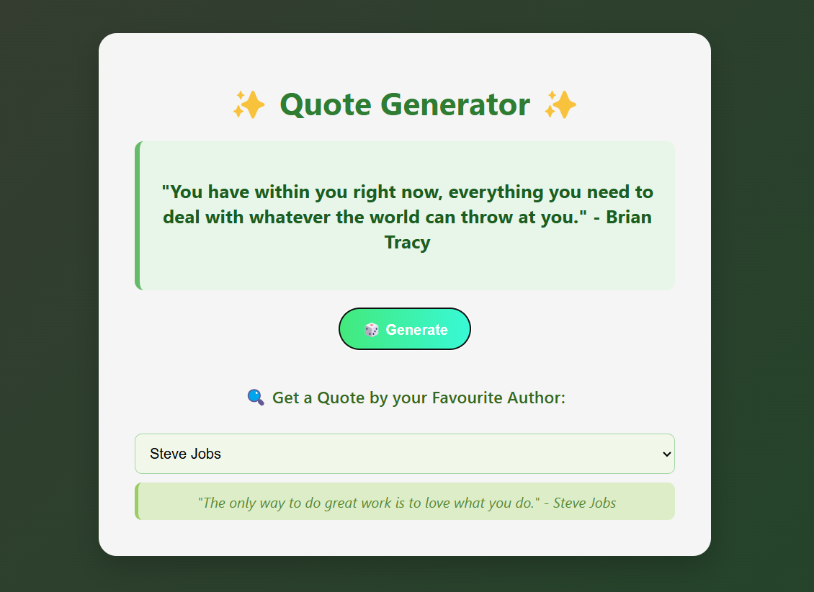

# ✨ Quotes Generator API & Web App

A full-stack Flask-based web application that serves motivational quotes through a RESTful API and a sleek frontend. Users can view random quotes, fetch quotes by their favorite authors, and even add their own!

Built with **Python Flask**and packaged with **Docker** for portable deployment.

---

## 📸 Preview

 <!-- Optional: Add your own screenshot image -->

---

## 🧠 Features

- 🎲 Random quote generator
- 🔍 Fetch quotes by author
- ✍️ Add your own quotes (POST API)
- 🧾 Get a dropdown of all available authors
- 📦 Dockerized for easy deployment

---

<h4>Thank You !! 😊</h4>

## Docker image
- Check out the docker image at : https://hub.docker.com/r/harshadaborse/quotes-generator
